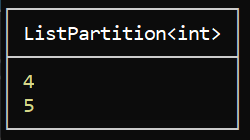

# LINQ 

There are *74* LINQ extension methods. 
Some are immediately executed, and some use *deferred* execution. 

We will see if immediate execution means that the entire enumerable will be enumerated. 

---

### Dumpify

We will also be using *Dumpify* NuGet package, and its `Dump()` method will output any object onto the screen in a well formatted way. You will also see the type. 

    

You can even provide a *string* in the argument to label it somehow.


---

## Filtering
* `Where`
* `OfType`

**Bonus tip**
When you create an array using the interface `IEnumerable<int>` and assign it a value like this `= [1,2,3` it will take a type of `ReadOnlyArray<int>`.

--- 

### `Where`
Takes a predicate, and it will apply it to each and every element of the collection. If the predicate returns true, it will be contained in the resulting collection, if not, it won't.

```c#
IEnumerable<int> collection = [1, 2, 3, 4, 5];

collection.Where(x => x > 2).Dump(); 
```


---

### `OfType`

Let's have a collection not only with integers but also with strings.
It will filter only a given type. If you assign it to a veriable, it will also convert it to a specific type, `IEnumerable<int>` or `IEnumerable<string>`, respectively. 

```c#
IEnumerable<object> collection = [1, "asdah", 2, 3, 4, 5];

IEnumerable<string> foo1 = collection.OfType<string>().Dump();
IEnumerable<int> foo2 = collection.OfType<int>().Dump();
```


---

## Partitioning

---

### `Skip`

As the word says, it will skip the first `n` elements.

```c#
IEnumerable<int> collection = [1, 2, 3, 4, 5];

collection.Skip(3).Dump();
```



---

### `Take`

As the word says, it will take the first `n` elements.

```c#
IEnumerable<int> collection = [1, 2, 3, 4, 5];

collection.Take(3).Dump();
```


---

### `SkipLast`

Kind of what you'd expect. Skips the last `n` elements.

```c#
IEnumerable<int> collection = [1, 2, 3, 4, 5];

collection.SkipLast(3).Dump();
```


---

### `TakeLast`

Same. Takes the last `n` elements from the collection

```c#
IEnumerable<int> collection = [1, 2, 3, 4, 5];

collection.TakeLast(3).Dump();
```


---

### `SkipWhile`

A bit different. It will take a predicate and iterate over the collection. As long as the predicate returns true it will be skipping the elements. 

```c#
IEnumerable<int> collection = [1, 2, 3, 4, 5];

collection.SkipWhile(x => x < 2).Dump();
```


---

### `TakeWhile`

Also a bit different. Same as `SkipWhile`, but it will take the elements as long as the predicate returns true. Unlike where, once the first `false` value is returned, it will stop iterating.

```c#
IEnumerable<int> collection = [1, 2, 3, 4, 5];

collection.TakeWhile(x => x < 2).Dump();
```


---

## Projection

---

### `Select`

Gives us the option to take each one of these elements and project it to a different thing.

```c#
IEnumerable<int> collection = [1, 2, 3, 4, 5];

collection.Select(x => x.ToString()).Dump();
```


#### Overload with index

```c#
IEnumerable<int> collection = [1, 2, 3, 4, 5];

collection.Select((x, i) => $"Index: {i}, original value: {x}, value * 2: {x * 2}").Dump();
```


---

